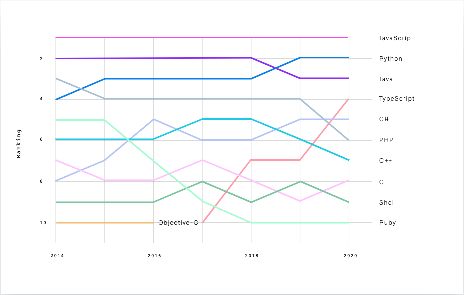
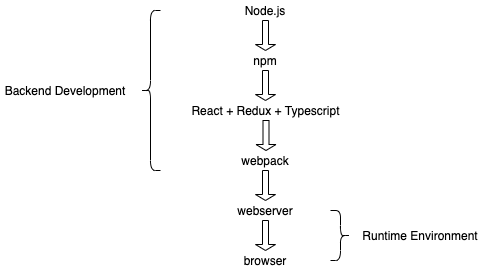
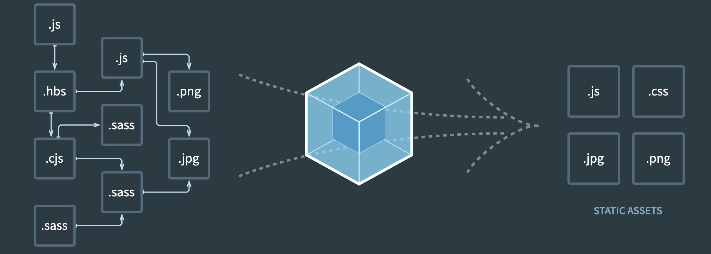
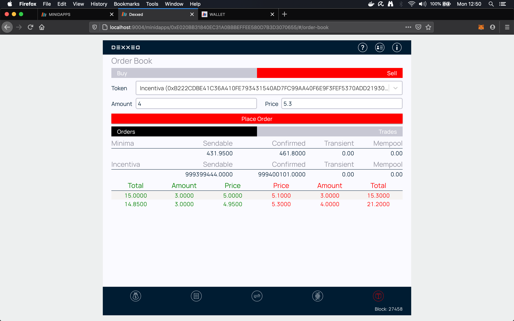

# An Introduction to React

Dr Steve Huckle - University of Sussex Lecturer and Senior Developer at [Minima Global](https://minima.global/).

s.huckle@sussex.ac.uk <br />
steve.huckle@minima.global


- - -

## A Quick Aside - Minima

<br />
[https://minima.global/](https://minima.global/)

[Minima](https://minima.global/) is creating a truly decentralised blockchain network that will operate as an open, co-operative ecosystem, within which users are free to transfer information (value) in a secure and trusted environment.

## Lecture Overview

+ What is React?
+ Why React?
+ Anatomy of a React project
+ **Warning** - it is a (fast) changing landscape
+ Useful resources

## Goals

1. Introduce React
2. Describe a typical build pipeline of a commercial React project
4. The **overarching** aim is to encourage you to build your own projects, using React!

# What is React?


_Image Source: [https://www.freecodecamp.org/news/react-js-for-beginners-props-state-explained/](https://www.freecodecamp.org/news/react-js-for-beginners-props-state-explained/)_

- - -

## React

+ React is an open-source, frontend JavaScript framework library for building user interfaces
+ It is designed to take the user (and developer) experience to the next level
+ It is maintained by Facebook _and_ a community of developers

## React + HTML

+ HTML on its own is a declarative markup language used for describing _how_ things look
+ HTML and JavaScript together provide an interactive client-side experience for users
+ Common (expected?) to write React using _JSX_ and use [Babel](https://babeljs.io/) to transpile that into native JavaScript that is supported by all browsers

# Why React?


_Image Source: [https://freesvg.org/black-question-mark-sign-vector-image](https://freesvg.org/black-question-mark-sign-vector-image)_

- - -

## Language Rankings



_Image Source: [https://octoverse.github.com/](https://octoverse.github.com/)_

## Download Trends


_Image Source: [https://www.npmtrends.com/react-vs-vue-vs-@angular/core](https://www.npmtrends.com/react-vs-vue-vs-@angular/core)_

## Jobs


_Image Source: [https://www.hntrends.com/2020/dec-year-unlike-any-other-tech-tools-didnt-change-much.html?compare=React&compare=Vue&compare=Angular+2&compare=AngularJS](https://www.hntrends.com/2020/dec-year-unlike-any-other-tech-tools-didnt-change-much.html?compare=React&compare=Vue&compare=Angular+2&compare=AngularJS)_

# Anatomy of a React Project


_Image Source: [https://medium.com/swlh/how-to-structure-your-typescript-react-redux-app-877d1eba1c1e](https://medium.com/swlh/how-to-structure-your-typescript-react-redux-app-877d1eba1c1e)_

- - -

## Architectural Overview



## Node.js and NPM

`Node.js` lets developers write server-side Javascript. However, it also provides build environment tools (which is how it is being used above).

+ `Node.js` is a JavaScript runtime environment
+ `npm` is a package manager for JavaScript
+ `npm` is the default package manager for `Node.js`

## Webpack



_Image Source: [https://v4.webpack.js.org/](https://v4.webpack.js.org/)_

## Typescript

+ TypeScript extends JavaScript by adding static typing
+ It is a strict syntactical superset of JavaScript
+ It transpiles to JavaScript
+ TypeScript helps catch errors _at compile time_, thus avoiding issues at _runtime_

## Redux

+ Redux is an open-source JavaScript library for managing application state
+ The state of your application is kept in a store
+ Each (React) component can access any state that it needs from the store

+ It makes application state _dependable_ and _predictable_
+ It facilitates communication and sharing of data
+ Redux helps separate UI from state


### Redux Store

Redux depends on actions, store, and reducers.

+ The store holds the application state
+ It should be the **single source of truth** for that state

### Redux Actions

+ Actions are events
+ They are the only way you can send data from your application to your store
+ Actions are sent to the store using `store.dispatch()`

### Redux Reducers

Redux reducers are based on the `reduce` function in JavaScript, which is a _pure high-order_ function where a single value is calculated from multiple input parameters:

```
const euros = [29.76, 41.85, 46.5];
const sum = euros.reduce((total, amount) => total + amount);
sum // 118.11
```

# Redux Reducer Example

+ Redux reducers are _pure functions_ that take the current state of an application, perform an action, and return a new state
```
const initialState: OrderBookProps = {
  data: []
}

export const reducer = (state: OrderBookProps = initialState, action: ActionProps): OrderBookProps => {

  if ( action.type == OrderBookActionTypes.ADD_ORDERS ) {  

    const orderBookData: OrderBookProps = action.payload as OrderBookProps
    return { ...state, data: orderBookData.data }

  } else {

    return state
  }
}
```

# Examples


_Image Source: [https://freesvg.org/logo-example-fruit-apple](https://freesvg.org/logo-example-fruit-apple)_

- - -

## Some Examples via Google

+ https://decembersoft.com/posts/starting-a-react-redux-project-with-typescript/
+ https://www.carlrippon.com/creating-react-and-typescript-apps-with-webpack/
+ https://www.freecodecamp.org/news/how-to-use-redux-in-your-react-typescript-app/
+ https://dev.to/jacopobonta/react-typescript-webpack-3c6l

## I Have Plenty of Examples!

https://github.com/glowkeeper

# A Changing Landscape


_Image Source: [https://www.theguardian.com/us-news/2019/aug/06/california-collapsing-beach-deaths-highlight-climate-fueled-erosion-crisis](https://www.theguardian.com/us-news/2019/aug/06/california-collapsing-beach-deaths-highlight-climate-fueled-erosion-crisis)_

- - -

## Wabi-sabi 侘寂

You must accept transience and imperfection, as none of the concepts introduced in this lecture are set in stone - javascript frameworks are a fast changing landscape...

e.g. last year's lecture: `All React components subclass React.Component` - just a year on, that is no longer true! Nowadays, it is more common to see a _functional_ approach.

## Hello (World)

```
interface HelloProps {
  entity: string
}

export const Hello = (props: HelloProps) => <h1>Hello {props.entity}</h1>
```
...and you'd use it like this:
```
const App = () => {

  const hello = <Hello entity="World"/>
  return (
    <>
      {hello}
    </>
  )
}
```

## A Real-life Example



## The Functional Solution

Sort is a (super-cool) high-order function that allows developers to define its behaviour via an (anonymous) function, which is given as an argument.
```
const sortOrderBook = (ordersData: OrderProps): Order[]  => {

  return ordersData.data?.sort((a: Order, b: Order) => {
    (a.isBuy === b.isBuy) ? (a.isBuy ? b.price.cmp(a.price) : a.price.cmp(b.price)) : 1 )
  }
}
```

# Useful Resources


_Image Source: [https://lochside.aberdeen.sch.uk/home-learning-resources/](https://lochside.aberdeen.sch.uk/home-learning-resources/)_

- - -

## React Sites

+ [https://reactjs.org/](https://reactjs.org/)
+ [https://www.w3schools.com/react/](https://www.w3schools.com/react/)
+ [https://www.typescriptlang.org/](https://www.typescriptlang.org/)
+ [https://redux.js.org/](https://redux.js.org/)
+ [https://webpack.js.org/](https://webpack.js.org/)
+ [https://nodejs.org/en/](https://nodejs.org/en/)
+ [https://www.npmjs.com/](https://www.npmjs.com/)

## Thank-you

[https://github.com/glowkeeper/reactLecture/](https://github.com/glowkeeper/reactLecture/)

s.huckle@sussex.ac.uk <br />
steve.huckle@minima.global

[https://minima.global/](https://minima.global/)<br />
[https://minima.global/get-involved](https://minima.global/get-involved)
